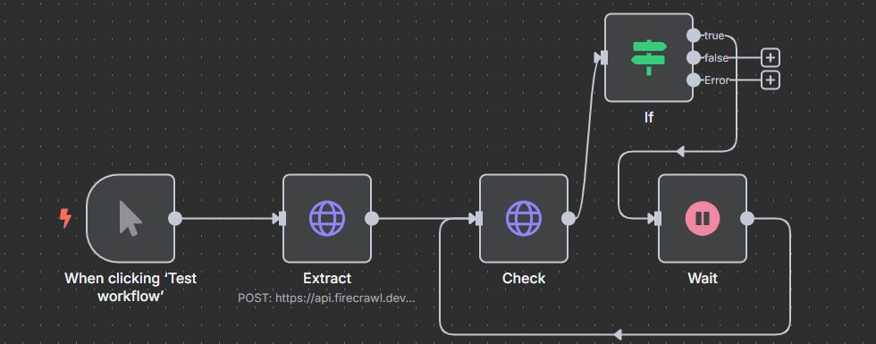
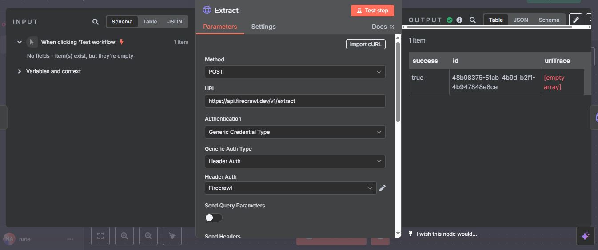
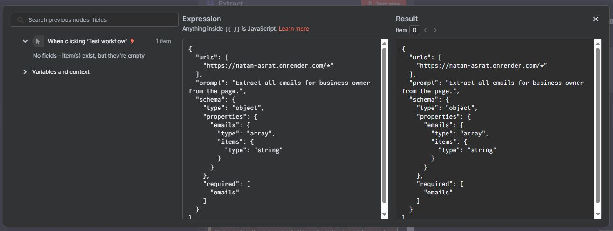
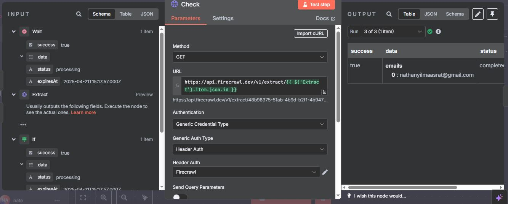
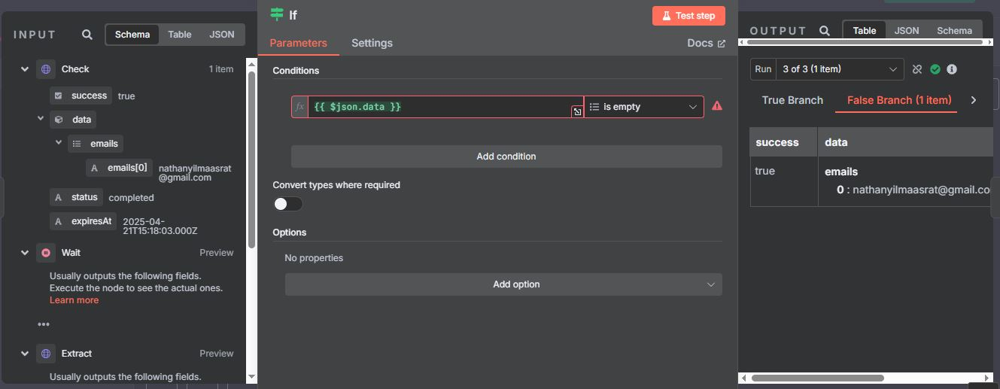
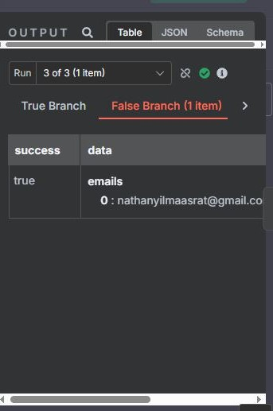

# N8N scraping (Firecrawl)
- Scraping my portfolio to get emails. Applicable for scraping business owner emails of known sites.
- You can check it out by importing `Firecrawl.json` into n8n.

## Nodes
 
- Extract: send post request to firecrawl to create a job that scrapes the provided url.
- Check: send get request to firecrawl to get the result of the job or keep waiting.
- If: if firecrawl returns an empty array, then keep waiting since the job is not completed. If not empty ("emails" array is in schema of data), then get the result. **Note: initially firecrawl returns an empty array while processing and returns an object with field "emails" which will give error in the check of array being empty since data is object now, so continue on Error is used.**

### Extract

- **Http Request Node**: Send post request to `https://api.firecrawl.dev/v1/extract`.
- **Body**:
    - ***urls***: array of urls to scrape
    - ***prompt***: prompt to tell firecrawl to scrape and get the emails
        - `Extract all emails for business owner from the page.`
    - ***schema***: schema to validate the scraped data (object)
        - ***emails***: key in schema (array of strings)

- **Authentication**:
    - Generic credential type
    - Header Auth
    - Authorization: Bearer YOUR_API_KEY 

### Check

- **Http Request Node**: Send get request to `https://api.firecrawl.dev/v1/extract/{{ $('Extract').item.json.id }}`.
    - Using `$('Extract').item.json.id` instead of `$json.id` because `Wait` node will call the `Check` node and in that case there wouldn't be no `json.id`, so I have to reference `Extract` node to get it's previous output.
- **Authentication**: same authentication as `Extract` node

### If

- **If Node**: If the job is not completed, firecrawl sends an empty array, so wait 5 more seconds and try again.
- **Authentication**: same authentication as `Extract` node

### Wait
- **Wait Node**: Wait 5 seconds.

## Output

- It has successfully scraped my email from my portfolio.

## Contact
 - LinkedIn: [Natan Asrat](https://linkedin.com/in/natan-asrat)
 - Gmail: nathanyilmaasrat@gmail.com
 - Telegram: [Natan Asrat](https://t.me/fail_your_way_to_success)
 - Youtube: [Natville](https://www.youtube.com/@natvilletutor)